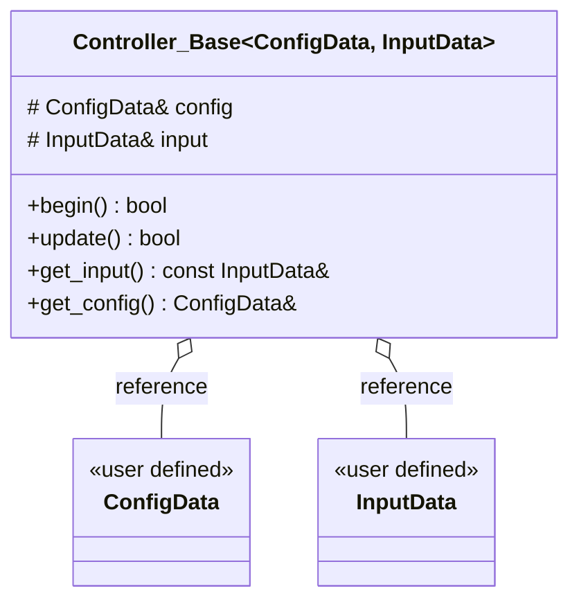

# ESP32 Controller
ESP32を有線/無線で操作する汎用コントローラークラス

> ## 変更履歴
> 2026-07-23    READMEに使用目的の追加、ソースコード内のコメント増補、命名の見直し、クラス図の追加  
> 2026-07-18    BluetoothSerial対応、Doxygen形式コメントの追加、I2CのデフォルトをMasterに変更  
> 2026-07-15    初期Verの公開  

## 使用目的
このライブラリは、主にESP32で制御されるロボット(手動機または自動機)の制御プログラムの可読性と機能の向上のために作成されました。機能としては、パソコン、マイコン、あるいはその他の機器(PS4のコントローラーなど)などからの有線/無線通信による入力を受け付けてユーザーが定義した構造体に格納することで、通信方法にとらわれないより抽象化されたプログラムの作成を可能とします。また、PS4コントローラーとの通信を除く全ての通信方法においてESP32からの構造体データの送信によってロボット機体から入力機器へのフィードバックも可能です。将来的には運動学計算、ハードウェア入出力ライブラリと合わせて組み換え可能なロボット制御を実現することを目指しています。

## ファイル構成
```
esp32-controller/
├─ examples/
│  ├─ blink_espnow/
│  │  └─ blink_espnow_receiver.ino  # ESP-NOW経由でLEDを付けたり消したりするサンプル
│  └─ closterium_ps4/
│     └─ closterium_ps4.ino         # ロッカーボギー機構がついた6輪ロボットをPS4コントローラーで動かすサンプル
├─ extras/
│  └─ serial_rimocon_raspi/
│     ├─ serial_rimocon.py          # Raspberry Piから構造体ベースのシリアル通信をするプログラム
│     └─ ESP32.json                 # 通信用設定ファイル
├─ src/
│  ├─ ESP32_Controller_BaseClass.h  # 基底クラスのヘッダファイル  直接使うことはない
│  ├─ ESP32_Controller_PS4.h        # PS4コントローラーとBluetoothで通信するクラスのヘッダファイル
│  ├─ ESP32_Controller_Serial.h     # シリアル通信(UART)で通信するクラスのヘッダファイル　双方向verもある
│  ├─ ESP32_Controller_I2C.h        # I2C通信で通信するクラスのヘッダファイル　双方向verもある
│  ├─ ESP32_Controller_BluetoothSerial.h # Bluetooth Classicで通信するクラスのヘッダファイル　双方向verもある
│  └─ ESP32_Controller_ESPNOW.h     # ESP-NOWで通信するクラスのヘッダファイル  双方向verもある
├─ library.properties
├─ LICENSE
└─ README.md

```

## 依存関係
ArduinoIDEのESP32を想定しています。  
- ArduinoIDE ver.2.3.10
- ESP32 ver.3.3.0
  
各外部ライブラリは適宜ライブラリマネージャーでインストールしてください。  
- [PS4Controller](https://github.com/pablomarquez76/PS4_Controller_Host) ver.1.1.0
- (RemoteXY ver. )

## ライブラリの入れ方
1. ブラウザでこのページを開いて、緑の四角から[Download ZIP]を選択してzipファイルをダウンロード  
2. ArduinoIDEの上部メニューから [スケッチ] ＞ [ライブラリをインクルード] ＞ [.ZIP形式のライブラリをインストール...] をクリック。  
3. ダウンロードしたZIPファイル（解凍しなくてOK）を選択し、[開く] を押す。  
画面下に「ライブラリがインストールされました」と出たら成功！  
(ArduinoIDEやESP32のボード、外部ライブラリのバージョンに注意)  
  
## 使い方
1. ``#include <ESP32_Controller_{操作方法}.h>``でインクルード  
2. やり取りしたい変数を格納するための操作用構造体を宣言して実体化  
    Serial,I2C,BluetoothSerial,ESP-NOWでは構造体の宣言末尾に``__attribute__((__packed__))``を付ける必要があります。  
    PS4では構造体内にPS4Controllerライブラリの関数から構造体内の変数への代入を行う関数``apply()``を宣言してください。  
3. 設定用の構造体(``Config_{操作方法}``)を実体化  
4. ``Controller<操作用構造体の型名> コントローラーオブジェクト(設定用構造体の実体名,操作用構造体の実体名);``で宣言  
5. setup関数内で``コントローラーオブジェクト.begin();``で初期化  
6. loop関数内で``コントローラーオブジェクト.update();``で値の更新  
7. ``コントローラーオブジェクト.get_input().やり取りしたい変数名``で値を取得  
8. データを送信する場合はloop関数内で``コントローラーオブジェクト.send()``を実行してください。  
    送信成功の可否は``コントローラーオブジェクト.get_config().send_success``(ESP-NOW)またはsend()の戻り値(それ以外)で参照できます。  

※ 詳細はソースコード内のコメントやexampleフォルダ内のサンプルスケッチを参照してください。

## クラス図
(mermaidはGitHubモバイル上では動作しないようなのでブラウザから閲覧してください)  
### 基底クラスと構造体の関係

### 基底クラスと各クラスの関係

```mermaid
classDiagram
    class Controller_Base~ConfigData, InputData~ {
        <<abstract>>
        # ConfigData& config
        # InputData& input
        +Controller_Base(ConfigData&, InputData&)
        +bool begin()*
        +bool update()*
        +const InputData& get_input()
        +ConfigData& get_config()
    }

    class Controller_BluetoothSerial~InputData~ {
        +bool begin()
        +bool update()
    }

    class Controller_BluetoothSerial_Response~InputData, OutputData~ {
        -OutputData& output
        +bool send()
    }

    class Controller_ESPNOW~InputData~ {
        -static Controller_ESPNOW* _instance
        -static void static_recv_cb(...)
        +bool begin()
        +bool update()
    }

    class Controller_ESPNOW_Response~InputData, OutData~ {
        -OutData& output
        -static Controller_ESPNOW_Response* _instance
        -static void static_recv_cb(...)
        -static void static_send_cb(...)
        +bool begin()
        +bool update()
        +void send()
    }

    class Controller_I2C_Master~InputData~ {
        +bool begin()
        +bool update()
    }

    class Controller_I2C_Master_Response~InputData, OutputData~ {
        -OutputData& output
        +bool send()
    }

    class Controller_I2C_Slave~InputData~ {
        -static Controller_I2C_Slave* _instance
        -static void static_recv_cb(int)
        +bool begin()
        +bool update()
    }

    class Controller_I2C_Slave_Response~InputData, OutputData~ {
        -OutputData& output
        -static Controller_I2C_Slave_Response* _instance
        -static void static_recv_cb(int)
        -static void static_request_cb()
        +bool begin()
        +bool update()
    }

    class Controller_PS4~InputData~ {
        +bool begin()
        +bool update()
    }

    class Controller_Serial~InputData~ {
        -HardwareSerial& SER
        +bool begin()
        +bool update()
    }

    class Controller_Serial_Response~InputData, OutputData~ {
        -OutputData& output
        +bool send()
    }

    Controller_Base <|-- Controller_BluetoothSerial
    Controller_BluetoothSerial <|-- Controller_BluetoothSerial_Response

    Controller_Base <|-- Controller_ESPNOW
    Controller_Base <|-- Controller_ESPNOW_Response

    Controller_Base <|-- Controller_I2C_Master
    Controller_I2C_Master <|-- Controller_I2C_Master_Response

    Controller_Base <|-- Controller_I2C_Slave
    Controller_Base <|-- Controller_I2C_Slave_Response

    Controller_Base <|-- Controller_PS4

    Controller_Base <|-- Controller_Serial
    Controller_Serial <|-- Controller_Serial_Response
```


## 参考プログラム(自作)
- [Planaria Renewal](https://github.com/Tomoooji/Planaria_renewal/blob/example/tomoooji/planaria_renewal/Controller_PS4.h)
- [Raspi Controller](https://github.com/Tomoooji/raspi-controller/blob/dev/src/ESP32_PranariaTest/SerialController.h)
- [ESPNOW Rimocon](https://github.com/Tomoooji/ESPNOW_Rimocon/blob/main/src/ESPNOW_Rimocon.h)
- [Rimocon RemoteXY](https://github.com/AiMEiBA-KwanseiGakuin/Mitochondria-KansaiHaru2026/blob/archive/Final/Rimocon_RemoteXY.h)

## License
This project is licensed under the GNU General Public License v3.0 (GPLv3) - see the [LICENSE](LICENSE) file for details.

This is required because the project depends on [PS4_Controller_Host](https://github.com/pablomarquez76/PS4_Controller_Host) which is licensed under GPLv3.


---
作成者:Tomoooji  
最終更新:2026-07-23  
