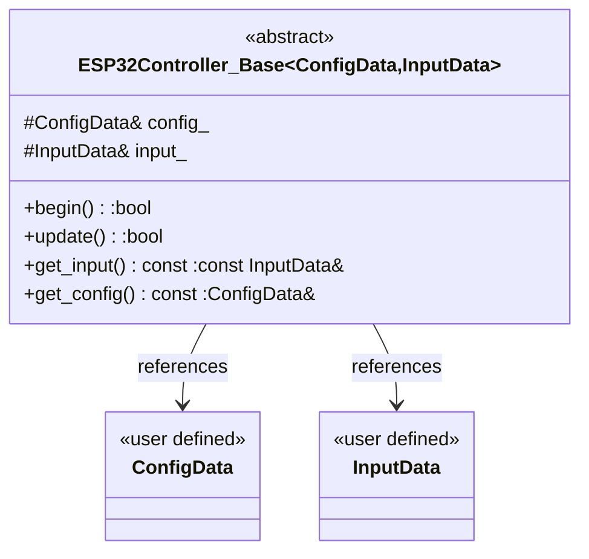
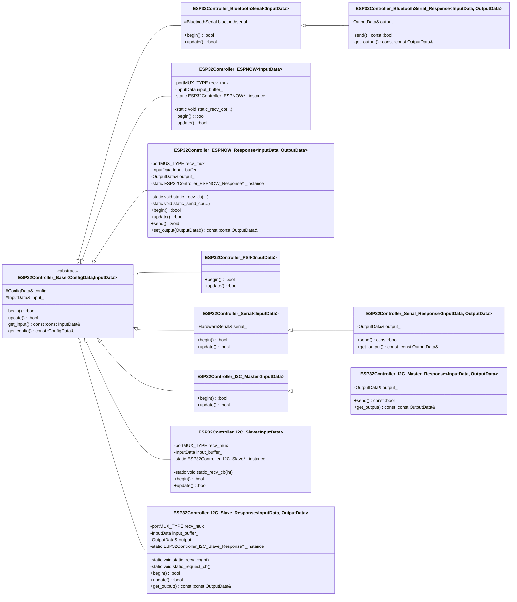

# ESP32 Controller

ESP32を有線/無線で操作する汎用コントローラークラス

> ## 変更履歴
>
> 2026-09-20    Ver2.0.0に更新  
> 2026-08-27    Ver1.0.0に更新  
> 2026-07-15    初期Verの公開  

## 使用目的

このライブラリは、主にESP32で制御されるロボット(手動機または自動機)の制御プログラムの可読性と機能の向上のために作成されました。機能としては、パソコン、マイコン、あるいはその他の機器(PS4のコントローラーなど)などからの有線/無線通信による入力を受け付けてユーザーが定義した構造体に格納することで、通信方法にとらわれないより抽象化されたプログラムの作成を可能とします。また、PS4コントローラーとの通信を除く全ての通信方法においてESP32からの構造体データの送信によってロボット機体から入力機器へのフィードバックも可能です。将来的には運動学計算、ハードウェア入出力ライブラリと合わせて組み換え可能なロボット制御を実現することを目指しています。

## ファイル構成
```
esp32-controller/
├─ examples/
│  ├─ closterium_ps4/
│  │  └─ closterium_ps4.ino         # ロッカーボギー機構がついた6輪ロボットをPS4コントローラーで動かすサンプル
│  └─ multi_blink/
│     ├─ receiver/
│     │  └─ receiver.ino            # 接続先のESP32から入力を受け取ってLEDを制御するサンプル
│     ├─ sender_bluetoothserial/
│     │  └─ sender_bluetoothserial.ino # BluetoothClassicで送信するサンプル
│     ├─ sender_espnow/
│     │  └─ sender_espnow.ino       # ESP-NOWで送信するサンプル
│     ├─ sender_i2c/
│     │  └─ sender_i2c.ino          # I2C通信で送信するサンプル
│     ├─ sender_serial/
│     │  └─ sender_serial.ino       # シリアル通信で送信するサンプル
│     ├─ blink_command.h            # 送受信者でやり取りする構造体の宣言
│     └─ Button.h                   # 送信側でボタン入力をイベント化する共通クラス
├─ extras/
│  └─ serial_rimocon_raspi/
│     ├─ serial_rimocon.py          # Raspberry Piから構造体ベースのシリアル通信をするプログラム
│     └─ ESP32.json                 # 通信用設定ファイル
├─ src/
│  ├─ ESP32Controller_Base.h        # 基底クラス群のヘッダファイル  直接使うことはない
│  ├─ ESP32Controller_PS4.h         # PS4コントローラーとBluetoothで通信するクラスのヘッダファイル
│  ├─ ESP32Controller_Serial.h      # シリアル通信(UART)で通信するクラスのヘッダファイル　双方向verもある
│  ├─ ESP32Controller_I2C.h         # I2C通信で通信するクラスのヘッダファイル　双方向verもある
│  ├─ ESP32Controller_BluetoothSerial.h # Bluetooth Classicで通信するクラスのヘッダファイル　双方向verもある
│  └─ ESP32Controller_ESPNOW.h      # ESP-NOWで通信するクラスのヘッダファイル　双方向verもある
├─ library.properties               # ArduinoIDE用
├─ library.json                     # PlatformIO用
├─ LICENSE
└─ README.md
```

## 依存関係

ArduinoIDEのESP32を想定しています。

- ArduinoIDE ver.2.3.10
- ESP32 ver.3.3.0

各外部ライブラリは適宜ライブラリマネージャーでインストールしてください。

- [PS4Controller](https://github.com/pablomarquez76/PS4_Controller_Host) ver.1.1.0
- ~~(RemoteXY ver. )~~

PlatformIOにも対応した...はず  
platformio.iniを以下のように設定してください。  
```
platform = https://github.com/pioarduino/platform-espressif32/releases/download/53.03.10/platform-espressif32.zip
board = esp32dev
framework = arduino
build_unflags = -std=gnu++11
build_flags = -std=gnu++20
lib_deps = https://github.com/Tomoooji/esp32-controller
```
PlatformIOの公式がEspressif Arduino 3.xを公式にサポートしていないためledcAttachやESP-NOWのコールバック関数の引数の型が最新ではないです。適宜旧verに変更して使用してください。

## ライブラリの入れ方(ArduinoIDE)

1. ブラウザでこのページを開いて、緑の四角から[Download ZIP]を選択してzipファイルをダウンロード
2. ArduinoIDEの上部メニューから [スケッチ] ＞ [ライブラリをインクルード] ＞ [.ZIP形式のライブラリをインストール...] をクリック。
3. ダウンロードしたZIPファイル（解凍しなくてOK）を選択し、[開く] を押す。
   画面下に「ライブラリがインストールされました」と出たら成功！
   (ArduinoIDEやESP32のボード、外部ライブラリのバージョンに注意)

## クラスを追加するとき
```c++
// 全てのクラスはESP32ControllerInternal名前空間内に定義されているので、
// 新しくクラスを作る場合はusing namespace ESP32ControllerInternal;を宣言するか、
// ESP32ControllerInternal::をつける必要がある
namespace ESP32ControllerInternal {

/* ----受信のみを行うクラスの場合---- */
// InputDataはユーザーが定義した構造体をtemplateに渡す
template <typename InputData>
class ESP32ControllerDummy : public Base<ESP32ControllerDummy::ConfigDummy, InputData> {
public:
  // Baseに定義されているConfigStructを継承してConfigDummyを定義することで、クラスごとに異なる設定用構造体を持てる
  struct ConfigDummy : public Base<ConfigDummy, InputData>::ConfigStruct {};

  // コンストラクタはBaseのコンストラクタを呼び出すだけでよい
  using Base<ConfigDummy, InputData>::Base;
  // 自前で定義する場合はConfigDummyとInputDataをstd::move()してBaseのコンストラクタに渡す
  ESP32ControllerDummy(ConfigDummy &&config_data, InputData &&input_data)
      : Base<ConfigDummy, InputData>(ConfigDummy{std::move(config_data)}, std::move(input_data)) {}

  // bool begin()とbool update()をoverrideして定義する必要がある
  bool begin() override {
    return true;
  }
  bool update() override {
    return false;
  }
  // Interface(Baseの親)に定義されているInputData& input()と ConfigResponseDummy& config()を用いてそれぞれのデータメンバにアクセスできる。(非同期にデータを受信する場合は別途bufferを用意し,update()内でCriticalSectionを使ってbufferにOutputDataの実体をコピーして送信する必要がある)
};

/* ----送受信用のクラスの場合---- */
// 送信用の構造体もユーザーが定義してtemplateに渡すことで通信相手に送信することができる
template <typename InputData, typename OutputData>
class ESP32ControllerResponseDummy : public ResponseBase<ESP32ControllerDummy<InputData>,ESP32ControllerResponseDummy::ConfigResponseDummy, InputData, OutputData> {
public:
  // ConfigResponseDummyはESP32ControllerDummyのConfigDummyを継承している(継承せずにConfigDummyをそのまま使うこともできる)
  struct ConfigResponseDummy : public ESP32ControllerDummy<InputData>::ConfigDummy {};

  // コンストラクタはResponseBaseのコンストラクタを呼び出すだけでよい
  using ResponseBase<ESP32ControllerDummy<InputData>, ConfigResponseDummy,InputData, OutputData>::ResponseBase;
  // 自前で定義する場合はConfigResponseDummyとInputData,OutputDataをstd::move()してResponseBaseのコンストラクタに渡す
  ESP32ControllerResponseDummy(ConfigResponseDummy &&config_data, InputData &&input_data, OutputData &&output_data)
      : ResponseBase<ESP32ControllerDummy<InputData>, ConfigResponseDummy, InputData, OutputData>(
        std::move(config_data), std::move(input_data), std::move(output_data)) {}

  // bool begin()とbool update()はESP32ControllerDummyのものをそのまま使えるのでオーバーライドする必要はないが、send()はESP32ControllerDummyにはないのでオーバーライドする必要がある
  bool begin() override {
    return true;
  }
  bool update() override {
    return false;
  }
  bool send() override {
    return true;
  }
  // 受信用クラスと同様、Interfaceに定義されているInputData& input()と ConfigResponseDummy& config()を用いてそれぞれのデータメンバにアクセスできる。(非同期な受信を行う場合の注意点も同様)
  // また、ResponseBaseに定義されているOutputData& output()を使うことでデータメンバであるOutputDataの実体に対する参照を取得できる。(これも非同期にデータを送信する場合は別途bufferを用意し,send()内でCriticalSectionを使ってbufferにOutputDataの実体をコピーして送信する必要がある)
};

} // namespace ESP32ControllerInternal

using ESP32Controller = ESP32ControllerInternal::ESP32ControllerDummy;
using ESP32ControllerResponse = ESP32ControllerInternal::ESP32ControllerResponseDummy;
```
## 使用例
```c++
// データを受信するだけの場合
#include "ESP32Controller_Dummy.h"

struct InputData {
  int32_t value;
} __attribute__((__packed__));

ESP32Controller<InputData> controller(
    {/*ConfigDummyの初期化*/}, {0}
);

void setup() {
  Serial.begin(115200);
  if (!controller.begin()) {
    Serial.println("Controller begin failed");
    while (1) {
      delay(1000);
    }
  }
}

void loop() {
  if (controller.update()) {
    Serial.println(controller.input().value);
  } else {
    Serial.println("Controller update failed");
  }
}
```
```c++
// データを送受信する場合
#include "ESP32Controller_Dummy.h"

struct InputData {
  int32_t value;
} __attribute__((__packed__));

struct OutputData {
  int32_t value;
} __attribute__((__packed__));

ESP32ControllerResponse<InputData, OutputData> controller(
    {/*ConfigResponseDummyの初期化*/}, {0}, {0}
);

void setup() {
  Serial.begin(115200);
  if (!controller.begin()) {
    Serial.println("Controller begin failed");
    while (1) {
      delay(1000);
    }
  }
}

void loop() {
  if (controller.update()) {
    Serial.println(controller.input().value);
    controller.output().value = 1234;
    if (!controller.send()) {
      Serial.println("Controller send failed");
    }
  } else {
    Serial.println("Controller update failed");
  }
}
```
---
## 使い方

1. ``#include <ESP32Controller_{操作方法}.h>``でインクルード
2. やり取りしたい変数を格納するための操作用構造体を宣言して実体化
3. 設定用の構造体(``Config_{操作方法}``)を実体化
4. ``Controller<操作用構造体の型名> コントローラーオブジェクト(設定用構造体の実体名,操作用構造体の実体名);``で宣言
5. setup関数内で ``コントローラーオブジェクト.begin();``で初期化(戻り値は初期化に成功したかどうか)
6. loop関数内で ``コントローラーオブジェクト.update();``で値の更新(戻り値は更新の有無)
7. ``コントローラーオブジェクト.get_input().やり取りしたい変数名``で値を取得
8. データを送信する場合は``コントローラーオブジェクト.set_output(送信用構造体の実体)``で送信データを更新し、loop関数内で ``コントローラーオブジェクト.send()``を実行  
   送信成功の可否は ``コントローラーオブジェクト.get_config().send_success``(ESP-NOW)またはsend()の戻り値(それ以外)で参照できます。

※ 詳細はソースコード内のコメントやexampleフォルダ内のサンプルスケッチを参照してください。

## 注意点
- ArduinoIDEでサンプルスケッチ(multi_blink)を実行する場合はblink_command.hとButton.hを同じフォルダにコピーしてください。  
### 入力用の構造体
- 送信側と受信側で完全に同一の構造体を使用してください。  
- シリアル通信、I2C通信、BluetoothSerial、ESP-NOWによる通信の際には``__attribute__((__packed__))``を末尾につけて宣言することによって通信データのバイナリレイアウトをそろえてサイズを小さくすることを推奨します。
- ``__attribute__((__packed__))``ありで宣言する場合、``int32_t``や``uint8_t``などの固定幅整数型を使い、アラインメントに配慮した宣言順にすることをおすすめします。
- PS4では構造体内にPS4Controllerライブラリの関数から構造体内の変数への代入を行う関数 ``apply()``を宣言してください。

### シリアル通信(UART)
- ESP32の``Serial``はデフォルトでUSBシリアルに接続されているため、シリアルモニタを使用する場合は別のUART(``Serial2``など)を使用してください。
- シリアル通信で一度に送信できるデータ量は最大で256バイトです。構造体のサイズが大きい場合は分割して送信する必要があります。
- SoftwareSerialには対応していません。HardwareSerialを使用してください。

### I2C通信
- Slave側のクラスは初期化時に指定した構造体と同じ構造体を用いて他のオブジェクトを作ることはできません。(ESP-NOWの項目にコード例があります。)

- Slave側のクラスではC++17以降に追加された記法を用いているため、PlatformIOで使用する場合はbuild_flagsに``-std=gnu++17``を追加してください。

### Bluetooth Classic通信

### ESP-NOW
- ESP-NOWで一度に送れるデータ量は最大で250バイトです。構造体のサイズが大きい場合は分割して送信する必要があります。

- ESP-NOWはESP32同士でしか通信できません。ESP32と他のマイコンやPCとの通信はできません。

- Controller_ESPNOWとController_ESPNOW_Responseクラスのオブジェクトは指定した構造体型のセットにつきに1つしか作れません。複数の構造体を送受信する場合は、構造体をまとめた構造体を作るか、ESP-NOWのMACアドレスを変更して複数のオブジェクトを作る必要があります。
    ``` C++
    ///////////////////

    // 例えばこんなコードを書いたとして...
    Config_ESPNOW config;

    struct Input_Command {
        ...
    } __attribute__((__packed__));
    Input_Command input_command;

    ESP32Controller<Input_Command> controller(config, input_command);

    ///////////////////

    // これはバグの原因になります。
    Input_Command another_command;
    ESP32Controller<Input_Command> another_controller(config, another_command); 

    ///////////////////

    // これは大丈夫
    struct Input_Command_another {
        ...
    } __attribute__((__packed__));
    Input_Command another_command;

    ESP32Controller<Input_Command> another_controller(config, another_command);

    ```
- ESP32Controller_ESPNOW_Responseクラスのsend()関数は送信完了を待たずに戻るため、送信完了を確認するにはコールバック関数で送信結果を確認する必要があります。

- C++17以降に追加された記法を用いているため、PlatformIOで使用する場合はbuild_flagsに``-std=gnu++17``を追加してください。

## クラス図

(mermaidはGitHubモバイル上では動作しないようなのでブラウザから閲覧してください)

<details><summary>

### 基底クラスと構造体の関係</summary>


```mermaid
classDiagram
    class ESP32Controller_Base~ConfigData,InputData~ {
        <<abstract>>
        #ConfigData& config_
        #InputData& input_
        +begin() :bool
        +update() :bool
        +get_input() const :const InputData&
        +get_config() const :ConfigData&
    }

    class ConfigData {
        <<user defined>>
    }

    class InputData {
        <<user defined>>
    }

    ESP32Controller_Base --> ConfigData : references
    ESP32Controller_Base --> InputData : references
```
</details><details><summary>

### 基底クラスと各クラスの関係</summary>


```mermaid
classDiagram
direction LR
    class ESP32Controller_Base~ConfigData,InputData~ {
        <<abstract>>
        #ConfigData& config_
        #InputData& input_
        +begin() :bool
        +update() :bool
        +get_input() const :const InputData&
        +get_config() const :ConfigData&
    }

    class ESP32Controller_BluetoothSerial~InputData~ {
        #BluetoothSerial bluetoothserial_
        +begin() :bool
        +update() :bool
    }

    class ESP32Controller_BluetoothSerial_Response~InputData, OutputData~ {
        -OutputData& output_
        +send() const :bool
        +get_output() const :const OutputData&
    }

    class ESP32Controller_ESPNOW~InputData~ {
        -portMUX_TYPE recv_mux
        -InputData input_buffer_
        -static ESP32Controller_ESPNOW* _instance
        -static void static_recv_cb(...)
        +begin() :bool
        +update() :bool
    }

    class ESP32Controller_ESPNOW_Response~InputData, OutputData~ {
        -portMUX_TYPE recv_mux
        -InputData input_buffer_
        -OutputData& output_
        -static ESP32Controller_ESPNOW_Response* _instance
        -static void static_recv_cb(...)
        -static void static_send_cb(...)
        +begin() :bool 
        +update() :bool
        +send() :void
        +set_output(OutputData&) const :const OutputData&
    }

    class ESP32Controller_PS4~InputData~ {
        +begin() :bool
        +update() :bool
    }

    class ESP32Controller_Serial~InputData~ {
        -HardwareSerial& serial_
        +begin() :bool
        +update() :bool
    }

    class ESP32Controller_Serial_Response~InputData, OutputData~ {
        -OutputData& output_
        +send() const :bool
        +get_output() const :const OutputData&
    }

    class ESP32Controller_I2C_Master~InputData~ {
        +begin() :bool
        +update() :bool
    }

    class ESP32Controller_I2C_Master_Response~InputData, OutputData~ {
        -OutputData& output_
        +send() const :bool
        +get_output() const :const OutputData&
    }

    class ESP32Controller_I2C_Slave~InputData~ {
        -portMUX_TYPE recv_mux
        -InputData input_buffer_
        -static ESP32Controller_I2C_Slave* _instance
        -static void static_recv_cb(int)
        +begin() :bool
        +update() :bool
    }

    class ESP32Controller_I2C_Slave_Response~InputData, OutputData~ {
        -portMUX_TYPE recv_mux
        -InputData input_buffer_
        -OutputData& output_
        -static ESP32Controller_I2C_Slave_Response* _instance
        -static void static_recv_cb(int)
        -static void static_request_cb()
        +begin() :bool
        +update() :bool
        +get_output() const :const OutputData&
    }

    ESP32Controller_Base <|-- ESP32Controller_BluetoothSerial
    ESP32Controller_BluetoothSerial <|-- ESP32Controller_BluetoothSerial_Response

    ESP32Controller_Base <|-- ESP32Controller_ESPNOW
    ESP32Controller_Base <|-- ESP32Controller_ESPNOW_Response

    ESP32Controller_Base <|-- ESP32Controller_PS4

    ESP32Controller_Base <|-- ESP32Controller_Serial
    ESP32Controller_Serial <|-- ESP32Controller_Serial_Response

    ESP32Controller_Base <|-- ESP32Controller_I2C_Master
    ESP32Controller_I2C_Master <|-- ESP32Controller_I2C_Master_Response

    ESP32Controller_Base <|-- ESP32Controller_I2C_Slave
    ESP32Controller_Base <|-- ESP32Controller_I2C_Slave_Response
```
</details>

## 参考プログラム(自作)

- [Planaria Renewal](https://github.com/Tomoooji/Planaria_renewal/blob/example/tomoooji/planaria_renewal/Controller_PS4.h)
- [Raspi Controller](https://github.com/Tomoooji/raspi-controller/blob/dev/src/ESP32_PranariaTest/SerialController.h)
- [ESPNOW Rimocon](https://github.com/Tomoooji/ESPNOW_Rimocon/blob/main/src/ESPNOW_Rimocon.h)
- [Rimocon RemoteXY](https://github.com/AiMEiBA-KwanseiGakuin/Mitochondria-KansaiHaru2026/blob/archive/Final/Rimocon_RemoteXY.h)

## License

This project is licensed under the GNU General Public License v3.0 (GPLv3) - see the [LICENSE](LICENSE) file for details.

This is required because the project depends on [PS4_Controller_Host](https://github.com/pablomarquez76/PS4_Controller_Host) which is licensed under GPLv3.

---

作成者:Tomoooji  
最終更新:2026-09-07  
